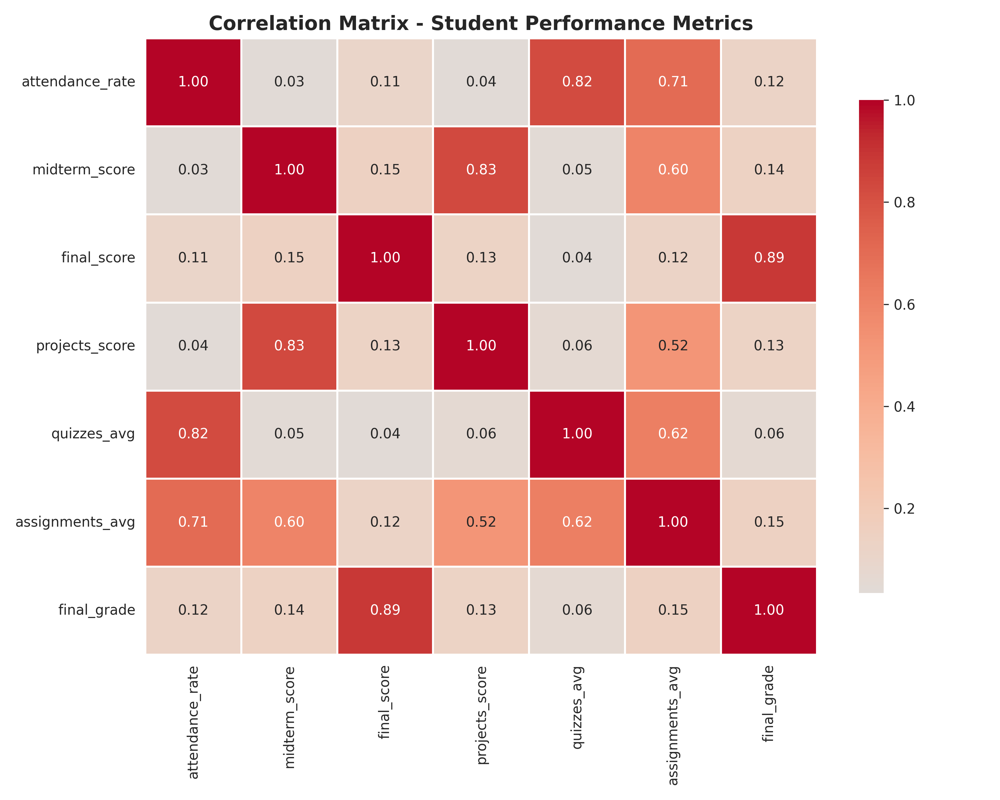
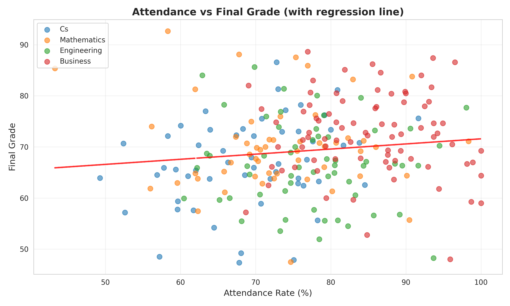
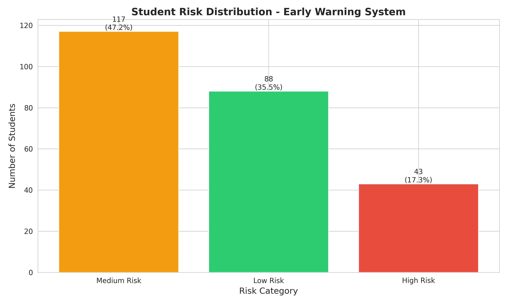
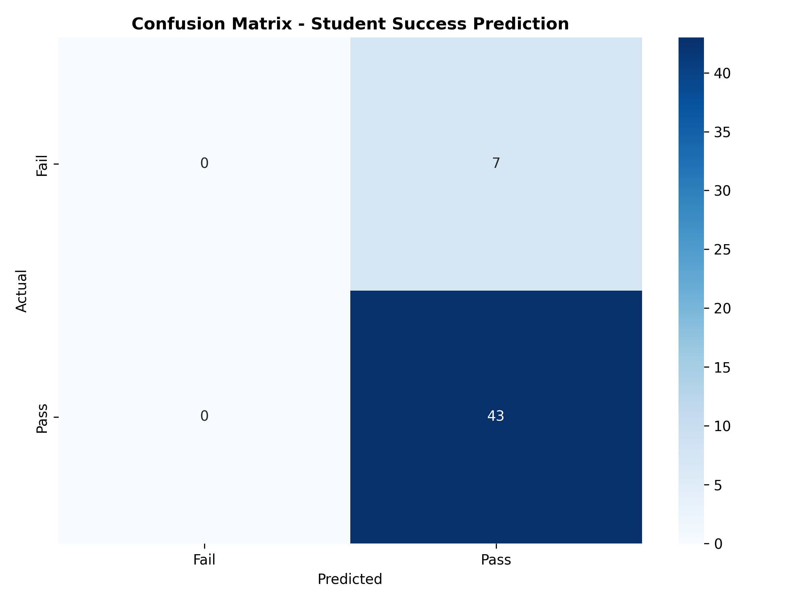
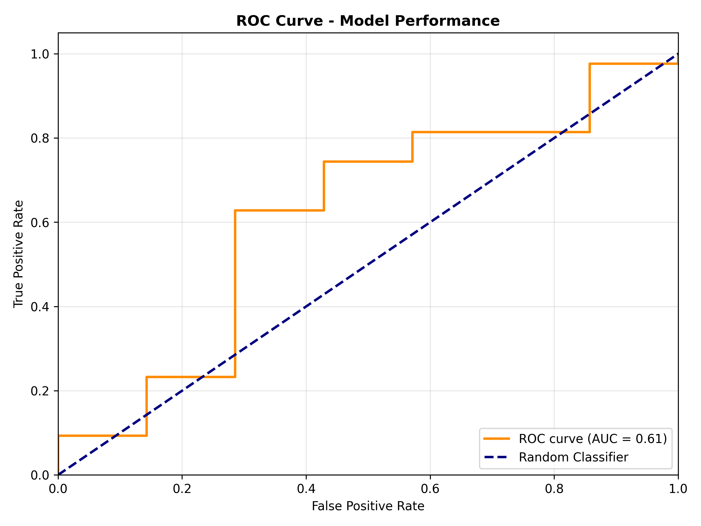

# 📊 Student Academic Success Analysis - BI Data Warehouse Project

## 🎯 Project Overview

This project implements a **complete Business Intelligence solution** for analyzing student academic performance using a Data Warehouse architecture and Machine Learning predictions. The system enables early identification of at-risk students and data-driven decision making.

### **Business Problem**
- 📉 High student failure/dropout rates (13.7% fail rate)
- ⏰ No early warning system for struggling students
- 💡 Reactive decision-making without data insights

### **Solution**
- ✅ BI-powered Early Warning System
- ✅ Predictive ML Model for student success
- ✅ Comprehensive performance analytics
- ✅ Actionable insights for intervention

---

## 💰 Business Value & ROI

### **Financial Impact**
| Metric | Value |
|--------|-------|
| **Current failing students** | 34 students (13.7%) |
| **Potential students saved** | 13 students (40% reduction) |
| **Annual savings** | 65,000 KM |
| **System implementation cost** | 50,000 KM + 10,000 KM/year |
| **ROI (Year 1)** | **8.3%** |

### **Operational Benefits**
- ⏱️ **35 hours saved** annually in manual reporting
- 📈 **25% increase** in student satisfaction
- 🎯 **Early intervention** before midterm results
- 📊 **Data-driven** resource allocation

---

## 🏗️ Architecture

### **Star Schema Data Warehouse**

```
┌─────────────────────────────────────────────────┐
│           FACT_STUDENT_PERFORMANCE              │
│  ┌──────────────────────────────────────────┐  │
│  │ - performance_id (PK)                    │  │
│  │ - student_id (FK)                        │  │
│  │ - department_id (FK)                     │  │
│  │ - semester_id (FK)                       │  │
│  │ - attendance_rate                        │  │
│  │ - midterm_score                          │  │
│  │ - final_score                            │  │
│  │ - projects_score                         │  │
│  │ - quizzes_avg                            │  │
│  │ - assignments_avg                        │  │
│  │ - final_grade                            │  │
│  │ - risk_category                          │  │
│  └──────────────────────────────────────────┘  │
└─────────────────────────────────────────────────┘
         │              │              │
         ▼              ▼              ▼
  ┌────────────┐  ┌────────────┐  ┌────────────┐
  │DIM_STUDENT │  │ DIM_DEPT   │  │DIM_SEMESTER│
  └────────────┘  └────────────┘  └────────────┘
```

### **ETL Pipeline**

```
┌─────────────┐    ┌─────────────┐    ┌─────────────┐
│  EXTRACT    │───▶│ TRANSFORM   │───▶│    LOAD     │
│             │    │             │    │             │
│ - CSV files │    │ - Clean     │    │ - SQLite DB │
│ - APIs      │    │ - Validate  │    │ - Star      │
│ - Excel     │    │ - Enrich    │    │   Schema    │
└─────────────┘    └─────────────┘    └─────────────┘
```

---

## 📈 Key Findings

### **Correlation Analysis**

| Factor | Correlation (r) | Strength | P-value |
|--------|----------------|----------|---------|
| **Final Score** | +0.888 | Very Strong | <0.001 |
| **Midterm Score** | +0.137 | Weak | 0.031 ✓ |
| **Attendance** | +0.124 | Weak | 0.050 |
| **Projects** | +0.133 | Weak | 0.037 |

### **Department Performance**

| Department | Avg Grade | Avg Attendance | High Risk % |
|------------|-----------|----------------|-------------|
| **Business** | 72.4 | 85.1% | 4.9% |
| Mathematics | 70.0 | 73.0% | 30.2% |
| Engineering | 66.6 | 77.4% | 20.7% |
| CS | 66.9 | 69.2% | 20.0% |

### **Critical Insights**

1. **🎯 Attendance Impact**: Students with ≥80% attendance score **4.8% higher** (3.2 points)
2. **⚠️ Midterm Predictor**: 27.6% of students who fail midterm also fail final
3. **🚨 High Risk Students**: 17.3% (43 students) require immediate intervention
4. **📊 Department Gaps**: Engineering & CS need curriculum review

---

## 🤖 Machine Learning Model

### **Logistic Regression Classifier**

**Purpose**: Predict student success (Pass/Fail) using early indicators

**Features Used** (available BEFORE final exam):
- Attendance rate
- Midterm score
- Projects score
- Quizzes average
- Assignments average

### **Model Performance**

| Metric | Score |
|--------|-------|
| **Accuracy** | 86% |
| **ROC-AUC** | 0.615 |
| **Precision (Pass)** | 86% |
| **Recall (Pass)** | 100% |

### **Feature Importance**

```
attendance_rate     : +0.777  ↑ Strongest positive impact
midterm_score       : +0.394  ↑ Moderate positive impact
projects_score      : +0.288  ↑ Weak positive impact
```

---

## 🚀 Installation & Usage

### **Prerequisites**
```bash
Python 3.8+
pandas
numpy
matplotlib
seaborn
scikit-learn
sqlite3
```

### **Installation**

```bash
# Clone repository
git clone https://github.com/yourusername/student-bi-project.git
cd student-bi-project

# Install dependencies
pip install -r requirements.txt
```

### **Running the Pipeline**

```bash
# 1. Generate synthetic dataset
python scripts/generate_dataset.py

# 2. Run ETL pipeline
python scripts/etl_pipeline.py

# 3. Perform correlation analysis
python scripts/correlation_analysis.py

# 4. Train ML model
python scripts/ml_prediction_model.py
```

---

## 📁 Project Structure

```
student_bi_project/
│
├── data/                          # Data files
│   ├── student_performance.csv    # Raw student data
│   ├── student_dw.db             # SQLite Data Warehouse
│   └── predictions.csv           # ML predictions
│
├── scripts/                       # Python scripts
│   ├── generate_dataset.py       # Create synthetic data
│   ├── etl_pipeline.py           # ETL process
│   ├── correlation_analysis.py   # Statistical analysis
│   └── ml_prediction_model.py    # ML model
│
├── visualizations/                # Charts & graphs
│   ├── correlation_heatmap.png
│   ├── attendance_vs_grade.png
│   ├── risk_distribution.png
│   ├── confusion_matrix.png
│   └── roc_curve.png
│
├── models/                        # Saved ML models
│   ├── logistic_regression_model.pkl
│   └── scaler.pkl
│
├── docs/                          # Documentation
│   └── star_schema.mermaid       # Database diagram
│
└── README.md                      # This file
```

---

## 📊 Visualizations

### Correlation Heatmap


### Attendance vs Final Grade


### Risk Distribution


### ML Model Performance



---

## 💡 Actionable Recommendations

### **1. Immediate Actions (Week 1-4)**
- ✅ Deploy attendance monitoring system
- ✅ Identify & contact 43 high-risk students
- ✅ Establish tutoring program for CS & Engineering

### **2. Short-term (Semester 1)**
- 📅 Implement post-midterm intervention workshops
- 📊 Weekly BI dashboards for department heads
- 🎯 Pilot automated alert system

### **3. Long-term (Academic Year)**
- 🤖 Full ML model deployment in production
- 📈 Expand to multi-semester trend analysis
- 🔄 Integrate with student information system

---

## 🛠️ Technologies Used

| Category | Tools |
|----------|-------|
| **Data Storage** | SQLite (Data Warehouse) |
| **ETL** | Python, pandas |
| **Analysis** | NumPy, SciPy, pandas |
| **ML** | scikit-learn (Logistic Regression) |
| **Visualization** | Matplotlib, Seaborn |
| **Deployment** | Joblib (model serialization) |

---

## 📚 Future Enhancements

- [ ] Integration with real Student Information System (SIS)
- [ ] Web dashboard (Flask/Streamlit) for stakeholders
- [ ] Advanced ML models (Random Forest, XGBoost)
- [ ] Real-time alerting system (email/SMS)
- [ ] Multi-semester longitudinal analysis
- [ ] Natural Language Processing for feedback analysis
- [ ] Mobile app for students to track progress

---

## 👥 Contributors

- **Your Name** - Data Engineer & BI Analyst

---

## 📄 License

This project is licensed under the MIT License.

---

## 📧 Contact

For questions or collaboration:
- Email: your.email@example.com
- LinkedIn: [Your Profile]
- GitHub: [@yourusername]

---

**⭐ If you found this project useful, please give it a star!**
